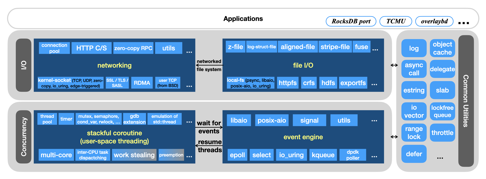

# PhotonLibOS

[](https://github.com/alibaba/PhotonLibOS/actions/workflows/ci.linux.x86_64.yml)
[](https://github.com/alibaba/PhotonLibOS/actions/workflows/ci.linux.arm.yml)
[](https://github.com/alibaba/PhotonLibOS/actions/workflows/ci.macos.x86_64.yml)
[](https://github.com/alibaba/PhotonLibOS/actions/workflows/ci.macos.arm.yml)

[PhotonlibOS.github.io](https://photonlibos.github.io)

## What's New
* Photon has been included in [awesome-cpp](https://github.com/fffaraz/awesome-cpp).
* Version 0.9 has been released in April 2025.
* We present an article to illustrate the theory of Photon's coroutine.
[Stackful Coroutine Made Fast](https://photonlibos.github.io/blog/stackful-coroutine-made-fast)
* Version 0.8 has been released in August 2024
* Feb 2024，[中文文档](https://photonlibos.github.io/cn/docs/category/introduction)在官网上线了
* Since 0.7, Photon will use release branches to enhance the reliability of software delivery. Bugfix will be merged into a stable release at first, then to higher release versions, and finally main.
* Since version 0.6, Photon can run with a userspace TCP/IP stack on top of `DPDK`.
[En](https://developer.aliyun.com/article/1208512) / [中文](https://developer.aliyun.com/article/1208390).
* How to transform `RocksDB` from multi-threads to coroutines by only 200 lines of code?
[En](https://github.com/facebook/rocksdb/issues/11017) / [中文](https://developer.aliyun.com/article/1093864).

<details><summary>Click to show more history...</summary><p>

* Version 0.5 is released. Except for various performance improvements, including spinlock, context switch,
  and new run queue for coroutine scheduling, we have re-implemented the HTTP module so that there is no `boost` dependency anymore.
* Version 0.4 has come, bringing us these three major features:
  1. Support coroutine local variables. Similar to the C++11 `thread_local` keyword. See [doc](doc/thread-local.md).
  2. Support running on macOS platform, both Intel x86_64 and Apple M1 included.
  3. Support LLVM Clang/Apple Clang/GCC compilers.
* Photon 0.3 was released on 2 Sep 2022. Except for bug fixes and improvements, a new `photon_std` namespace is added.
  Developers can search for `std::thread`, `std::mutex` in their own projects, and replace them all into the equivalents of `photon_std::<xxx>`.
  It's a quick way to transform thread-based programs to coroutine-based ones.
* Photon 0.2 was released on 28 Jul 2022. This release was mainly focused on network socket, security context and multi-vcpu support.
  We re-worked the `WorkPool` so it's more friendly now to write multi-vcpu programs.
* Made the first tag on 27 Jul 2022. Fix the compatibility for ARM CPU. Throughly compared the TCP echo server performance with other libs.

</p></details>

## Introduction
Photon is a C++ library designed to augment the operating system in terms of
high-performance concurrent I/O programming. Photon is collected from Alibaba
Cloud Storage team's internal code base. It has been extensively tested and
used in production, and is the same code they depend on in their daily lives.

Photon features a highly efficient user-space threading model, implemented as
coroutines with multi-core CPU support, driven by a variety of asynchronous
event engines such as ```epoll```, ```io_uring```, and ```kqueue```, etc.
These event engines are abstracted behind a lightweight, unified interface.

Built on this foundation, Photon provides a comprehensive set of high-level
abstractions for networking and file I/O operations, leveraging both kernel-based
system calls and high-performance user-space frameworks like DPDK and SPDK.

Furthermore, Photon includes entirely new, ground-up implementations of key
distributed system components, including RPC, HTTP client and server, and
Redis client, etc., delivering significantly higher performance and efficiency
compared to existing solutions. The architecture of Photon is illustrated below:



Photon is well-suited for developing any I/O-intensive applications,
including those involving disk I/O and/or network I/O.

* **Performance** Photon can switch to a thread in just a few nanoseconds;
  this action corresponds to callback in a typical asynchronous framework.
  The cost of creating a new thread is primarily a simple malloc(),
  and the allocation can be pooled for even greater efficiency.
  Performance benchmarks on I/O workloads are available
  [here](https://photonlibos.github.io/docs/category/performance).

* **Production** Photon is the foundation of many production systems in
  (listing in alphabetical order)
  [Alibaba Group](https://www.alibabagroup.com/en-US),
  [Ant Group](https://www.antgroup.com/en),
  [ByteDance](https://www.bytedance.com/en/),
  [Xiaomi](https://www.mi.com/global/),
  [XSKY](https://www.xsky.com/en/),
  etc., and many open source projects in public domain.

  * [overlaybd](https://github.com/containerd/overlaybd),
  a sub-project of [containerd](https://containerd.io/), which is deployed
  at scale in Alibaba's own infrastructure as well as the public cloud platform.

  * [OSSFSv2](https://www.alibabacloud.com/help/en/oss/developer-reference/ossfs-2-0/),
  a high-performance client for Alibaba Cloud's object storage service (OSS)
  that provides a POSIX-compliant file system interface to the users.

  * [Connector for AI/ML](https://github.com/aliyun/oss-connector-for-ai-ml),
  a high-performance storage driver for popular AI frameworks, such as
  Pythorch, safetensors, vllm, etc., supporting dataset reading, checkpointing,
  model loading.

  * [P2P Transport](https://www.alibabacloud.com/help/en/acr/use-the-p2p-acceleration-feature-in-ask-and-ack-clusters),
  a key component that addresses the scalability issue of large scale data
  serving, which is found in many scenarios like container image service, or
  AI model loading, etc.

  * Caching services, such as [OSS Accelerator](https://www.alibabacloud.com/help/en/oss/overview-77/),
  a multi-tenant distributed caching service for high-performance object access;
  or [EFC cache](https://www.alibabacloud.com/help/en/nas/user-guide/enable-the-distributed-caching-feature-of-the-cnfs-client),
  a client-side caching module for elastic file client (EFC).

  * [KTransformers](https://kvcache-ai.github.io/ktransformers/),
  a flexible, Python-centric AI framework with advanced kernel optimizations
  and placement/parallelism strategies, designed with extensibility at its core.
  Photon is [used](https://github.com/alibaba/PhotonLibOS/issues/642) to
  asynchronously load kvcache data from disk to memory, or vice versa.

  * [The coroutine engine in VLang](https://github.com/vlang/v/blob/bfee8248603cfbe4022de8364260133f90d1783b/vlib/coroutines/README.md)

* **Agility** Photon is designed to support a wide range of applications —
  and is already deployed in production across diverse environments. We’ve
  gone beyond mere feasibility, engineering it to be not only highly adaptable,
  but also intuitive, convenient, and fast to use. This is made possible
  through a set of well-defined, modular abstractions that decouple core
  logic from underlying system specifics, enabling both flexibility and
  performance.

* **Portability** Photon supports multiple platforms, i.e. the
  combinations of {Linux, macOS} * {x86_64, ARM64} * {gcc, clang}.

* **Inclusion** in [awesome-cpp](https://github.com/fffaraz/awesome-cpp)

## Community

 Join Slack: [link](https://join.slack.com/t/photonlibos/shared_invite/zt-25wauq8g1-iK_oHMrXetcvWNNhIt8Nkg)

 Join DingTalk group: 55690000272
