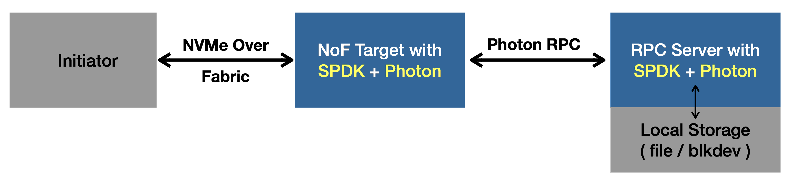

photon folder is a new custom spdk bdev module using photon.

Please integarate this module into spdk codes according to https://spdk.io/doc/bdev_module.html "Creating Bdevs in an External Repository".
This module is depend on photon. You can compile photon with "cmake -B build" and "make -C build -j 8", then install it with "make -C build install".
And add compile flag "-lphoton" to this module's Makefile.

Photon provide an example server with two kind of storage backend (nvme ssd / local fs).
Start the server with "sudo ./build/examples-output/bdev_photon_server", more option see bdev_photon_server_main.cpp
Then you can try this new bdev with spdk's hello_bdev, hello_world, nvmf_tgt, etc.