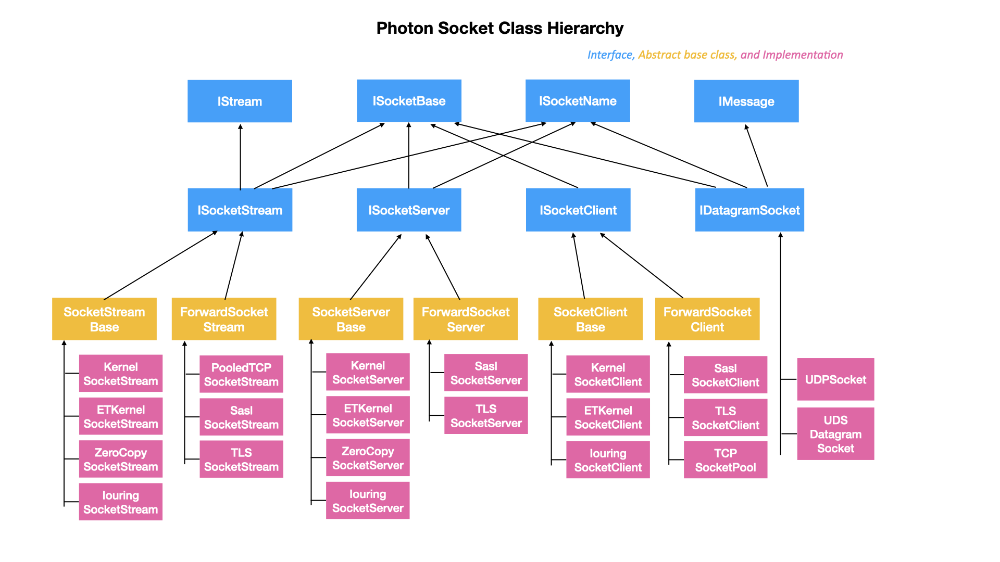

# Network lib

### API (net/socket.h)

Network lib provides non-blocking socket implementations for clients and servers.

```cpp
    ISocketClient* new_tcp_socket_client();
    ISocketServer* new_tcp_socket_server();
    ISocketClient* new_uds_client();
    ISocketServer* new_uds_server(bool autoremove = false);
    ISocketClient* new_iouring_tcp_client();
    ISocketServer* new_iouring_tcp_server();
    ...
```

### Client and Server

```cpp
class ISocketClient : public ISocket {
public:
    virtual ISocketStream* connect(const EndPoint& ep) = 0;
    virtual ISocketStream* connect(const char* path, size_t count = 0) = 0;
};

class ISocketServer : public ISocket {
public:
    virtual int bind(uint16_t port = 0, IPAddr addr = IPAddr()) = 0;
    virtual int bind(const char* path, size_t count) = 0;
    virtual int listen(int backlog = 1024) = 0;
    virtual ISocketStream* accept(EndPoint* remote_endpoint = nullptr) = 0;
    using Handler = Callback<ISocketStream*>;
    virtual ISocketServer* set_handler(Handler handler) = 0;
    virtual int start_loop(bool block = false) = 0;
    virtual void terminate() = 0;
};
```

### ISocketStream

ISocketStream is inherited from IStream, with some socket operations like recv, send, timeout, etc.

```cpp
namespace photon {
namespace net {
    class ISocketStream : public IStream {
    public:
        // Receive some bytes from the socket;
        // Return the actual number of bytes received, which may be LESS than `count`;
        virtual ssize_t recv(void *buf, size_t count) = 0;
        virtual ssize_t recv(const struct iovec *iov, int iovcnt) = 0;

        // Send some bytes to the socket;
        // Return the actual number of bytes sent, which may be LESS than `count`;
        virtual ssize_t send(const void *buf, size_t count) = 0;
        virtual ssize_t send(const struct iovec *iov, int iovcnt) = 0;
        
        // Fully receive until `count` bytes.
        virtual ssize_t read(void *buf, size_t count) = 0;
        virtual ssize_t readv(const struct iovec *iov, int iovcnt) = 0;
        
        // Fully send until `count` bytes.
        virtual ssize_t write(const void *buf, size_t count) = 0;
        virtual ssize_t writev(const struct iovec *iov, int iovcnt) = 0;
    };
}
}
```

## IPv4 Address
```cpp
namespace photon {
namespace net {
    union IPAddr {
        // Save IP address as a 32 bits integer, or 4 bytes.
        uint32_t addr = 0;
        struct { uint8_t a, b, c, d; };

        // Create from the Internet host address, in network byte order, or from string
        explicit IPAddr(uint32_t nl);
        explicit IPAddr(const char* s)
        
        uint32_t to_nl() const;
        void from_nl(uint32_t nl);
    };

    // EndPoint represents IP address and port
    struct EndPoint {
        IPAddr addr;
        uint16_t port;

        // convert from the typical struct sockaddr_in
        sockaddr_in to_sockaddr_in() const;
        void from_sockaddr_in(const struct sockaddr_in& addr_in);
    };

    // operators to help logging IP addresses with alog
    LogBuffer& operator << (LogBuffer& log, const IPAddr addr);
    LogBuffer& operator << (LogBuffer& log, const EndPoint ep);
}
}
```

## Socket class hierarchy




